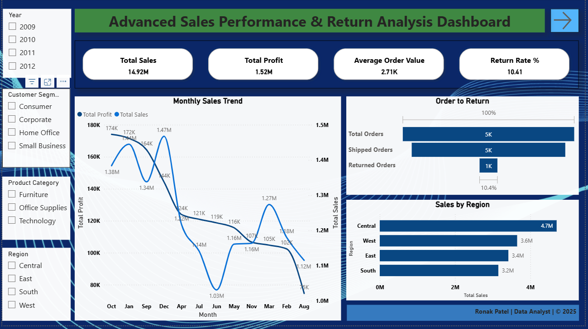

# 📊 Superstore Sales Performance & Returns Dashboard

A comprehensive and interactive Power BI dashboard designed to monitor, analyze, and optimize sales performance, product trends, and return patterns across regions and customer segments. This project enables decision-makers to track KPIs, evaluate manager-level performance using RLS, and gain operational insights from returns data.

---

## 📊 Dashboard Preview

---

## ✅ Project Objectives

- Provide interactive, visual insights into sales performance over time.
- Track key sales metrics like Total Revenue, Profit, AOV, and Return Rate.
- Enable region-wise and manager-specific drilldowns using Row-Level Security (RLS).
- Analyze top-performing products, categories, and high-return items.
- Identify trends and anomalies across different customer segments and geographies.

---

## 📈 Key KPIs & Metrics

- 💰 **Total Sales**  
- 📈 **Average Order Value (AOV)**  
- 📉 **Profit Margin %**  
- 🔁 **Return Rate % (clean DAX logic)**  
- 🌍 **Sales by Region, Segment, and Category**  
- 🛍️ **Top Products by Revenue and Profit**  
- ⏳ **Sales Trend Over Time (Monthly/Yearly)**

---

## 🧩 Dashboard Pages

### 1. **Executive Overview**
- High-level KPIs with dynamic titles and slicers
- Monthly trend analysis of revenue and profit
- Funnel-style breakdown of orders vs. returned items

### 2. **Product Insights**
- Top 10 products by sales
- Category and Sub-category level revenue analysis
- TreeMap and matrix visuals for multi-dimensional view

### 3. **Region & Manager View**
- Region-wise sales breakdown
- Manager performance through Row-Level Security (RLS)
- Customer segment distribution and AOV trends

### 4. **Returns Analysis**
- Return Rate % trend by month
- Returned orders by category, sub-category, and city
- Insights into high-return SKUs and operational impact

---

## 🔐 Row-Level Security (RLS)

- Region and Manager-based access filters using the `Dim_Users` table
- Role-based visibility setup via **Power BI Manage Roles**
- Tested using “View As” for individual managers

---

## 🎨 Features Implemented

- Interactive slicers for Year, Region, Product Category, and Segment
- Dynamic titles using DAX (`SELECTEDVALUE`)
- Card, Line, Bar, TreeMap, Donut, Matrix, and Table visuals
- DAX-based return logic using `IsReturned` flag
- Clean layout with synced slicers and page navigation buttons
- Export-ready layout (PDF, PNG)

---

## 🔄 Future Enhancements

- Connect to Power BI Service for scheduled data refresh and email subscriptions
- Integrate KPI-based alerts using Power Automate
- AI Forecasting for sales using Power BI forecasting visuals
- CRM integration (Salesforce, Zoho) via Power Query/API connectors

---

## 🧠 Insights Summary

| Area | Key Insight |
|------|-------------|
| Products | Small % of SKUs contribute to most sales (Pareto 80/20). High returns in Office Supplies. |
| Regions | East and Central dominate revenue, West has high return % |
| Managers | Variance in AOV and conversion visible through RLS |
| Returns | Return spikes correlate with discounts & bulky SKUs. Shipping mode also impacts return volume. |

---

## 📁 Files Included

- `Superstore-Sales-Performance-Dashboard.pbix` — Main Power BI file
- `Insights.pdf` *(optional)* — Insight summary for presentation use
- `Dashboard-preview.png` — Screenshot of Executive Page

---

## 👨‍💻 Created By

**Ronak Ambu Patel**  
🎓 Data Analyst | 📊 Power BI | SQL | Python  
🔗 [LinkedIn](https://www.linkedin.com/in/ronak171990) | 💼 [Portfolio](https://github.com/ronak171990)

---

## 📢 Feedback

If you liked this dashboard, feel free to ⭐ the repo or reach out on LinkedIn with suggestions or opportunities!
